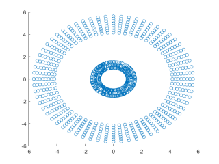

# 2D - Spatial Dataset for Clustering

클러스터링은 사용되는 분야와 데이터 특징에 따라 정말 다양하게 응용되고 있습니다. 하지만, 기본적인 '군집'의 메커니즘은 모두 동일하기 때문에 논문에서 아이디어를 제안단계에서는 2차원 군집 데이터를 많이 활용하고 있습니다. 클러스터링 연습이나 구현 또는 제안하려는 기법의 평가를 위해 사용되는 2-3차원 데이터셋 모음입니다.

# 2D - DATASET
|  Non labeled              |Filename                            |size                         |
|----------------|-------------------------------|-----------------------------|
|		|`data_0.mat`       | 300 x 2	|                 
|		|`data_1.mat`		| 600 x 2	|
|		|`data_2.mat`		| 300 x 2	|     
|		|`data_3.mat`     	| 1000 x 2	|                 
|		|`data_4.mat`	 	| 1012 x 2	|
|		|`data_5.mat`	   	| 1016 x 2	| 
|		|`data_6.mat`     	| 2000 x 2	|             

|  Hand labeled               |Filename                            |size                         |
|----------------|-------------------------------|-----------------------------|
|		|`data_7.mat`       | 788 x 3	|                 
|		|`data_8.mat`		| 399 x 3	|
|		|`data_9.mat`		| 300 x 3	|     
    

## Switch to another file

## Rename a file

## Delete a file

## Export a file

