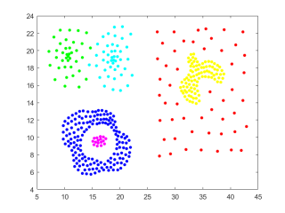
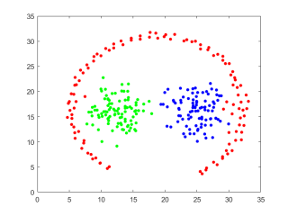

# 2D - Spatial Dataset for Clustering

클러스터링은 사용되는 분야와 데이터 특징에 따라 정말 다양하게 응용되고 있습니다. 하지만, 기본적인 '군집'의 메커니즘은 모두 동일하기 때문에 논문에서 아이디어를 제안단계에서는 2차원 군집 데이터를 많이 활용하고 있습니다. 클러스터링 연습이나 구현 또는 제안하려는 기법의 평가를 위해 사용되는 2-3차원 데이터셋 모음입니다.

# 2D - DATASET
|  Non labeled              |Filename                            |size          |               
|----------------|-------------------------------|-----------------------------|
|		|`data_0.mat`       | 300 x 2	|                 
|		|`data_1.mat`		| 600 x 2	|
|		|`data_2.mat`		| 300 x 2	|     
|		|`data_3.mat`     	| 1000 x 2	|                 
|		|`data_4.mat`	 	| 1012 x 2	|
|		|`data_5.mat`	   	| 1016 x 2	| 
|		|`data_6.mat`     	| 2000 x 2	|             

|  Hand labeled               |Filename                            |size                         |
|----------------|-------------------------------|-----------------------------|
|		|`data_7.mat`       | 788 x 3	|                 
|		|`data_8.mat`		| 399 x 3	|
|		|`data_9.mat`		| 300 x 3	|     
    

## Info
`data_0.mat ~ data_6.mat`  데이터셋은 목표값이 지정되어있지 않습니다. 하지만, 직관적으로 클러스터의 개수를 판단할 수 있습니다.  `data_7.mat ~ data_9.mat` 데이터는 목표값이 데이터의 z축 값으로 표현됩니다. 예를 들어 $n \times 3$의 크기를 가질때, 데이터는 1~2 차원 까지 좌표축으로 표현되는 데이터값이며 3차원 데이터가 라벨 데이터입니다.

## Clustering Result
제가 2019년도 제안했던 [DTSCAN 논문](https://www.mdpi.com/1424-8220/19/18/3926) 에서 평가 결과 일부를 첨부했습니다. 기존 레퍼런스 논문에서 제안된 클러스터링 기법을 이용한 `data_7.mat` 군집 결과입니다.

	

